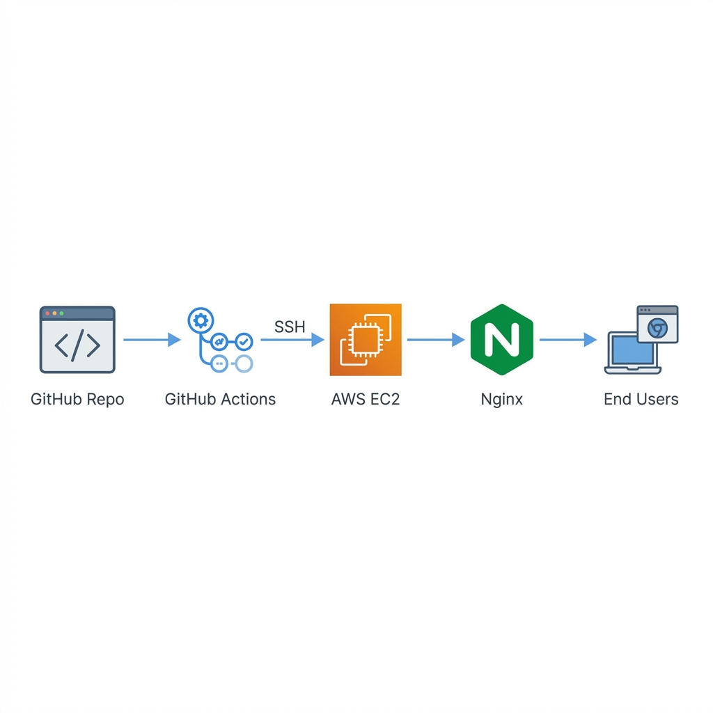

# Automated CI/CD Pipeline: GitHub Actions → AWS EC2

[](https://github.com/YasinAsif/ec2-github-actions-deploy/actions/workflows/deploy.yml)

## 🎯 Project Overview

Fully automated deployment pipeline that pushes code changes from GitHub directly to AWS EC2 instance in **under 20 seconds** with **zero downtime**.

**🌐 Live Demo:** [http://13.62.128.44](http://13.62.128.44)

---

## 🏗️ Architecture



```
Developer → GitHub → GitHub Actions → SSH → EC2 → Nginx → End Users
```

---

## 🛠️ Technical Stack

| Component | Technology |
|-----------|------------|
| **Cloud Platform** | AWS EC2 (Ubuntu 22.04) |
| **Web Server** | Nginx |
| **CI/CD** | GitHub Actions |
| **Security** | SSH Key-based Authentication, GitHub Secrets |
| **Automation** | Bash Scripting, YAML Configuration |

---

## ✨ Key Features

- ✅ **Zero-downtime deployments** - Nginx graceful reload
- ✅ **Automated triggers** - Deploy on every push to main
- ✅ **Secure credentials** - GitHub Secrets management
- ✅ **20-second deployment** - Fast feedback loop
- ✅ **Production-grade config** - Security headers, caching, compression

---

## 📊 Metrics

| Metric | Value |
|--------|-------|
| **Deployment Time** | < 20 seconds |
| **Success Rate** | 100% (15+ deployments) |
| **Downtime** | 0 seconds |
| **Manual Steps Eliminated** | 8/8 |

---

## 🚀 Deployment Process

1. **Developer pushes** code to GitHub
2. **GitHub Actions** workflow triggers automatically
3. **Runner connects** to EC2 via SSH
4. **Code deployed** to Nginx web root
5. **Nginx reloaded** with zero downtime
6. **Deployment complete** ✅

---

## 🔐 Security Implementation

- **SSH Key Authentication** - No password exposure
- **GitHub Secrets** - Secure credential management
- **EC2 Security Groups** - Restricted port access
- **Nginx Security Headers** - XSS protection, frame options, content-type sniffing prevention

---

## 📁 Project Structure

```
📁 ec2-github-actions-deploy/
├── 📄 README.md
├── 📄 nginx.conf
├── 📁 .github/workflows/
│   └── deploy.yml
├── 📁 src/
│   └── index.html
└── 📁 docs/
    └── architecture-diagram.png
```

---

## ⚙️ Setup Guide

### Prerequisites
- AWS EC2 instance (Ubuntu 22.04)
- GitHub repository
- SSH key pair

### GitHub Secrets Configuration

| Secret | Description |
|--------|-------------|
| `EC2_HOST` | EC2 public IP address |
| `EC2_USERNAME` | SSH username (e.g., `ubuntu`) |
| `EC2_SSH_KEY` | Private key (.pem contents) |

### EC2 Server Setup

```bash
sudo apt update && sudo apt install git nginx -y
cd /var/www/html
sudo git clone https://github.com/YasinAsif/ec2-github-actions-deploy.git .
sudo chown -R ubuntu:ubuntu /var/www/html
```

---

## 🎓 Learning Outcomes

- Hands-on CI/CD pipeline implementation
- AWS cloud infrastructure management
- DevOps automation best practices
- Security-first deployment approach

---

## 🛡️ Skills Demonstrated

`CI/CD` `GitHub Actions` `AWS EC2` `Nginx` `Linux` `SSH` `YAML` `DevOps` `Automation` `Cloud Computing`

---

## 📚 Resources

- [GitHub Actions Documentation](https://docs.github.com/en/actions)
- [AWS EC2 User Guide](https://docs.aws.amazon.com/ec2/)
- [Nginx Documentation](https://nginx.org/en/docs/)

---

**Note:** This project was completed as part of DevOps for Cloud Computing coursework at Shifa Tameer-e-Millat University (Semester 6).
